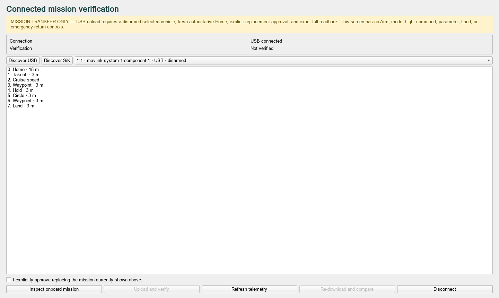
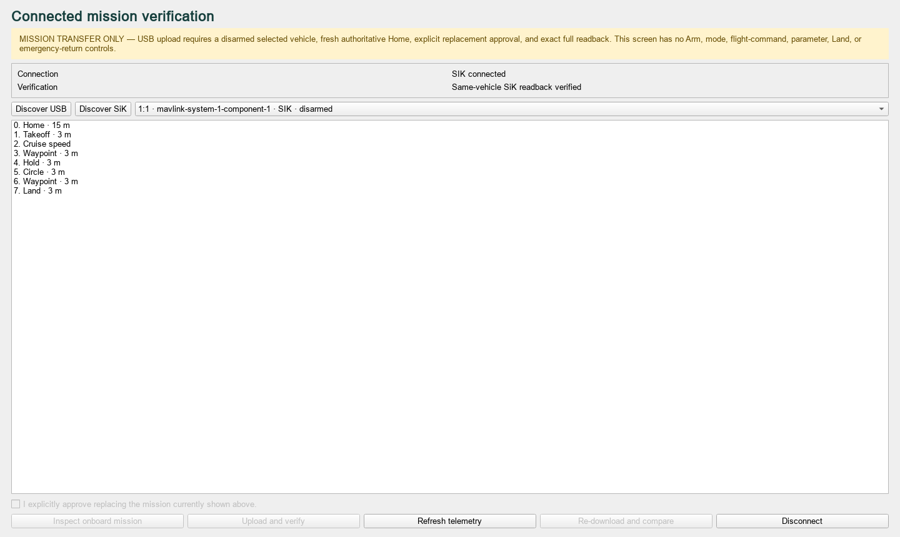

# Connected mission integration

Task 009 composes the accepted offline compiler, ArduCopter 4.6.3 compatibility
envelope, mission-only MAVLink adapter, read-only telemetry adapter, and pinned SITL
harness. It does not merge those compartments or make the offline Builder depend on
a connection or simulator.

## Production boundary

`ConnectedMissionService` owns immutable application state and accepts an injected
`ConnectedVehiclePort`. `ConnectedMavlinkPort` delegates discovery to the accepted
heartbeat selector, upload/download to `MissionProtocol`, success to exact
compatibility-envelope verification, and telemetry to
`TelemetryAdapter`/`TelemetryPoller`. It contains no protocol normalization and no
generic send method.

The connected UI emits typed intents only. Blocking discovery and mission transactions
remain caller-worker responsibilities; Qt callbacks do not perform serial or MAVLink I/O.
The visible surface contains mission inspection, explicit replacement approval,
upload/readback verification, disconnect, telemetry refresh, and same-vehicle SiK
re-verification. It contains no Arm, mode, AUTO, Pause/Resume, Land Here Now, RTL,
parameter, or generic command control.

## Fail-closed lifecycle

```text
compiled
  -> USB discovered + exactly one target selected
  -> existing mission downloaded and shown
  -> operator explicitly confirms replacement
  -> fresh selected-target heartbeat and HOME_POSITION
  -> disarmed USB upload
  -> accepted ACK + complete INT readback + normalized exact match
  -> USB_VERIFIED
  -> disconnect => REVERIFY_REQUIRED
  -> SiK discovers the same vehicle identity
  -> fresh telemetry + complete download + exact match
  -> SIK_VERIFIED
```

The upload preparation path uses an explicit receive-side readiness handshake: it exits
only after both the selected-target heartbeat and `HOME_POSITION` have crossed the real
telemetry adapter. Reaching the bounded deadline without Home returns typed
`HOME_UNRESOLVED`; a partial snapshot is never treated as uploadable.

An edit clears the translated package and verification. Cancellation, disconnect,
stale identity, wrong identity, missing/stale/wrong-vehicle Home, unexpected armed state,
negative acknowledgment, retry exhaustion, protocol error, or any unapproved readback
difference cannot produce readiness. Reconnection by itself never restores readiness.

## UI evidence





## Pinned SITL evidence

The Ubuntu workflow runs the genuine connected test twice in fresh stock ArduCopter
4.6.3 processes on isolated port blocks 26200 and 26300. Each run proves USB discovery,
live Home translation, mission upload and exact readback, disconnect/restart over an
explicitly classified SiK link, same-vehicle comparison, read-only telemetry, execution
of Takeoff–Proceed–Hold–Circle–Land, and a protocol-independent raw reference readback.

Stock Copter cannot execute a mission without normal arming and AUTO mode. The two
necessary stimuli exist only in `tests/sitl/test_connected_integration.py`, use normal
arm with force value zero, target ephemeral stock SITL, and are not reusable production
or UI APIs. Before that normal arm stimulus, the test requires a fresh same-connection
`SYS_STATUS` proving ArduPilot's enabled pre-arm bit is healthy. The harness launches
with the exact official Copter defaults selected by the pinned source's `quad` mapping;
their hash and effective `FRAME_CLASS=1` / `FRAME_TYPE=0` are retained in evidence.
This is stock startup initialization through `--defaults`, not a MAVLink parameter
write. Later Tasks 100–102 still own native pre-arm review, production normal-arm, and
production AUTO-start compartments.

The direct stock-binary TCP session does not assume an ambient `SYS_STATUS` stream.
The same-connection check immediately before the test-only arm uses a bounded read-only
`MAV_CMD_REQUEST_MESSAGE(SYS_STATUS)` handshake. It never invokes
`MAV_CMD_RUN_PREARM_CHECKS`; an accepted request-message command is not treated as
readiness unless the returned health bitmap itself passes. Reusable Task 006 readiness
does not claim arm readiness while GPS/EKF state is still settling.

AUTO also requires the estimator position that pinned Copter checks after arming. The
execution boundary therefore uses the same read-only request mechanism for
`EKF_STATUS_REPORT` and requires `EKF_POS_HORIZ_ABS` without
`EKF_CONST_POS_MODE` before the normal arm. Those are the pinned source's armed
absolute-position conditions. Position and pre-arm snapshots share one 30-second
readiness deadline; neither the arm nor AUTO stimulus is sent if either condition is
unresolved.

Each evidence directory retains the verified binary identity, exact process command,
SITL stdout/stderr, readiness protocol trace, `connected-integration.json`, teardown
result, and `SHA256SUMS`, including on failure. The workflow uploads the complete tree
for 30 days.

## Platform and hardware limits

The official pinned SITL artifact is Linux x86_64. Windows developers can run all
deterministic application, protocol, UI, and harness-contract tests locally, but genuine
stock-SITL execution occurs on the approved Ubuntu GitHub runner unless an equivalent
Linux environment is installed. SITL is evidence infrastructure, never a runtime
dependency.

No real-hardware claim is made. Matek H7A3/H743 exact target/revision and USB interface
mapping remain unresolved. USB-C describes connector shape, not the serial or bootloader
interface. Holybro 933 MHz versus any SiK alternative, firmware, regulatory region, and
baud plan also remain unresolved and require props-off hardware validation. Clone radios
must not be assumed equivalent.
